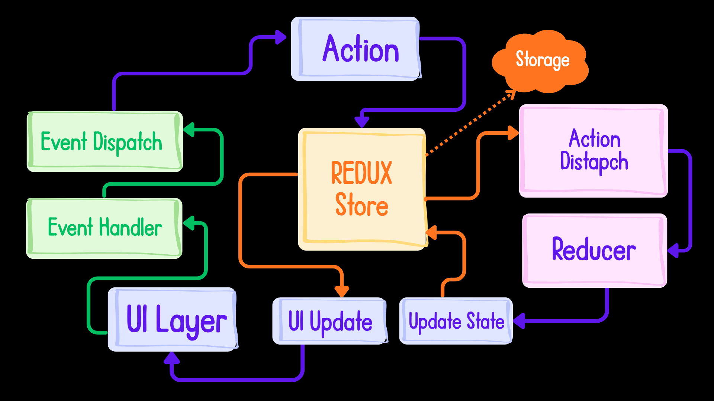

# About <mark style="background-color: purple; color: white">Redux</mark> & <mark style="background-color: purple; color: white">Redux Toolkit</mark>

This project implements **Redux Toolkit (RTK)** for efficient and predictable state management. Below is a comprehensive breakdown of how Redux works and why RTK is the industry standard.

---

## 1.  <mark style="background-color: pink">What is Redux?
Redux is a pattern and library for managing and updating application state. Think of it as a **Centralized Warehouse** for all the data (state) in your application. Instead of passing data through multiple layers of components (prop drilling), every component can access the warehouse directly.

###  <mark style="background-color: skyblue">Why use Redux?
* **Predictability:** Since state is updated in a specific way, you always know how and when your data changed.
* **Centralization:** All application state lives in one place, making it easier to debug and persist data.
* **Time Travel Debugging:** You can track every single change to the state and even "move back in time" to see previous versions of your UI.

---

## 2.  <mark style="background-color: pink">The Three Pillars of Redux
Redux operates on three fundamental rules:

1.  **Single Source of Truth:** The state of your entire application is stored in an object tree within a single **Store**.
2.  **State is Read-Only:** The only way to change the state is to emit an **Action** (an object describing what happened). You never mutate the state directly.
3.  **Changes are made with Pure Functions:** To specify how the state tree is transformed by actions, you write **Reducers**. Reducers take the old state and an action, and return a *new* state.

---

## 3.  <mark style="background-color: skyblue">What is Redux Toolkit (RTK)?
Redux Toolkit is the official, recommended way to write Redux logic. If Redux is the engine, RTK is the entire car it comes with everything pre-installed and ready to drive.

### Problems RTK Solves:
* **"Boilerplate" Overload:** Standard Redux required writing a lot of repetitive code (action types, action creators, reducers). RTK simplifies this into "Slices."

* **Complex Configuration:** Setting up a store used to require multiple middleware and devtool configurations. RTK’s `configureStore` does this automatically.

* **Accidental Mutations:** In standard Redux, mutating state directly would break the app. RTK uses the **Immer** library, allowing you to write "mutating" code (like `state.push()`) that safely updates the state immutably behind the scenes.

---

## 4. <mark style="background-color: pink">Architecture & Workflow



The workflow follows a strict **unidirectional data flow**:

1.  **UI (Component):** A user clicks a button (e.g., "Add to Cart").
2.  **Dispatch:** The component triggers (dispatches) an **Action**.
3.  **Store/Slice:** The **Reducer** inside the Slice hears the action.
4.  **State Update:** The Reducer calculates the new state.
5.  **UI Update:** The UI "subscribes" to the store and automatically re-renders with the new data.

---

## 5.  <mark style="background-color: lightyellow; color: orange">Core Concepts in RTK

###  <mark style="background-color: yellow">Store
The "Global Warehouse." It holds the entire state of your application.
```javascript
// configureStore creates the store and combines reducers
const store = configureStore({
  reducer: {
    counter: counterReducer,
  },
});
```

### <mark style="background-color: yellow">Slices
A Slice is a collection of Redux reducer logic and actions for a single feature (e.g., `userSlice`, `cartSlice`).
```javascript
const counterSlice = createSlice({
  name: 'counter',
  initialState: { value: 0 },
  reducers: {
    increment: (state) => { state.value += 1 }, // "Mutating" logic made safe by Immer
  },
});
```

### <mark style="background-color: yellow">Selectors
Functions used to "select" or extract specific pieces of data from the store.
```javascript
const count = useSelector((state) => state.counter.value);
```

### <mark style="background-color: yellow">Dispatch
The method used to send actions to the store to trigger a state change.
```javascript
const dispatch = useDispatch();
dispatch(increment());
```


## 1. The Global Hub: `configureStore`
The `store` is the central brain of your application. `configureStore` simplifies the setup by automatically combining your reducers and adding essential middleware (like Redux Thunk).

### Key Benefits:
* **Automatic Middleware:** Sets up Redux DevTools and Thunk out of the box.
* **Reducer Combination:** You don't need `combineReducers`; just pass an object.

```typescript
import { configureStore } from '@reduxjs/toolkit';
import counterReducer from './features/counterSlice';

export const store = configureStore({
  reducer: {
    counter: counterReducer, // Add your slices here
  },
});
```

---

## 2. Logic Modules: `createSlice`
In traditional Redux, you had to write actions and reducers separately. `createSlice` allows you to define the **initial state**, **reducers**, and **actions** all in one place.

> **Pro Tip:** RTK uses a library called **Immer** internally. This means you can "mutate" state (e.g., `state.value += 1`) and RTK will safely handle the immutability for you.

```typescript
import { createSlice, PayloadAction } from '@reduxjs/toolkit';

const counterSlice = createSlice({
  name: 'counter',
  initialState: { value: 0 },
  reducers: {
    increment: (state) => {
      state.value += 1;
    },
    incrementByAmount: (state, action: PayloadAction<number>) => {
      state.value += action.payload;
    },
  },
});

export const { increment, incrementByAmount } = counterSlice.actions;
export default counterSlice.reducer;
```

---

## 3. Handling API Calls: `createAsyncThunk`
Redux is synchronous by nature. To handle asynchronous logic (like fetching data from an API), we use `createAsyncThunk`. It manages the lifecycle of a promise: **Pending**, **Fulfilled**, and **Rejected**.


```typescript
import { createAsyncThunk } from '@reduxjs/toolkit';

export const fetchUsers = createAsyncThunk('users/fetchAll', async () => {
  const response = await fetch('https://api.example.com/users');
  return response.json();
});

// Inside createSlice, handle these states in "extraReducers"
extraReducers: (builder) => {
  builder
    .addCase(fetchUsers.pending, (state) => { state.loading = true; })
    .addCase(fetchUsers.fulfilled, (state, action) => {
      state.loading = false;
      state.data = action.payload;
    });
}
```

---

## 4. The React Bridge: Hooks
To connect your React components to the Redux store, we use two primary hooks: `useSelector` and `useDispatch`.

### `useSelector` (The Listener)
Used to extract specific data from the Redux store. Think of it as a "query" for your state.
* **Usage:** `const count = useSelector((state) => state.counter.value);`

### `useDispatch` (The Messenger)
Used to send (dispatch) actions to the store to trigger state changes.
* **Usage:** `const dispatch = useDispatch();`

### Implementation Example:
```tsx
import { useSelector, useDispatch } from 'react-redux';
import { increment } from './counterSlice';

const CounterComponent = () => {
  const count = useSelector((state: RootState) => state.counter.value);
  const dispatch = useDispatch();

  return (
    <div>
      <h1>Count: {count}</h1>
      <button onClick={() => dispatch(increment())}>Add 1</button>
    </div>
  );
};
```

---

## Summary Table

| Tool | Purpose | Real-world Analogy |
| :--- | :--- | :--- |
| **`configureStore`** | The Central Store | The Warehouse building |
| **`createSlice`** | Logic & Data | The Department (e.g., Electronics) |
| **`createAsyncThunk`**| Async Tasks | The Delivery Truck (takes time) |
| **`useSelector`** | Read Data | The Customer looking at a shelf |
| **`useDispatch`** | Trigger Change | The Cashier processing an order |

---

